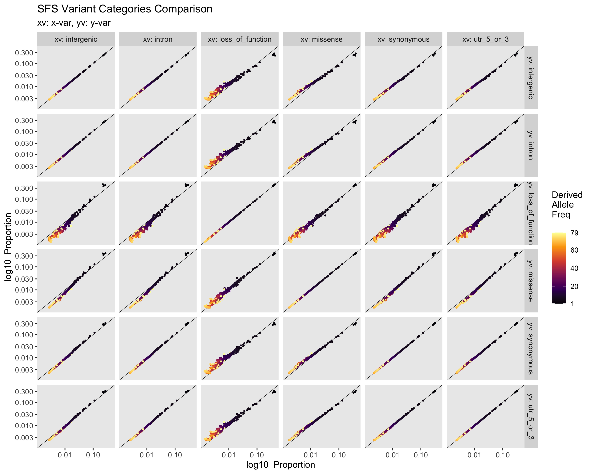
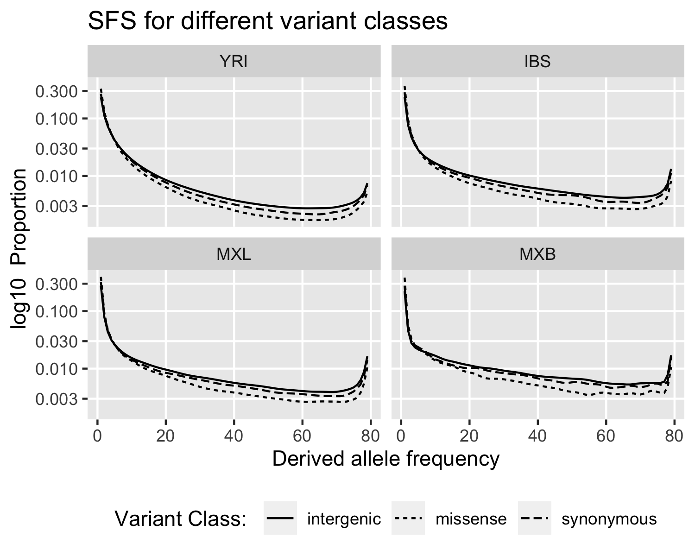
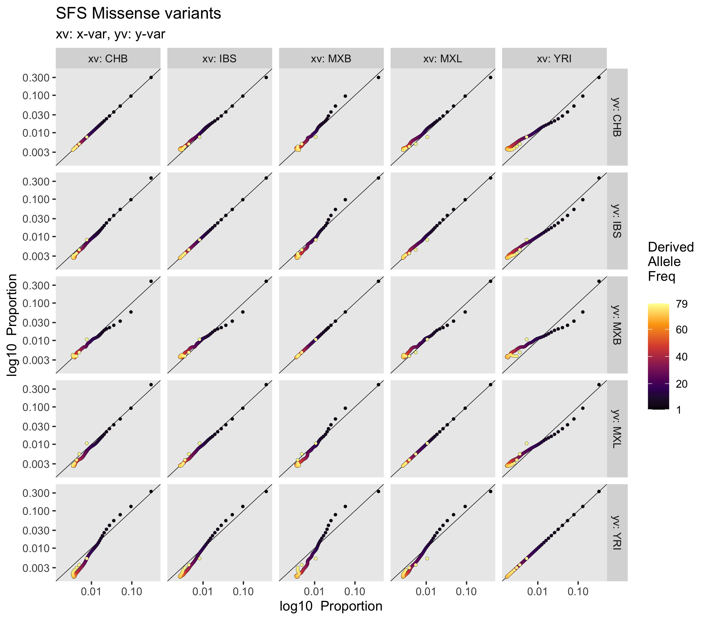
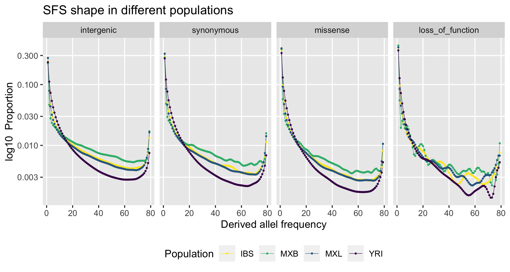
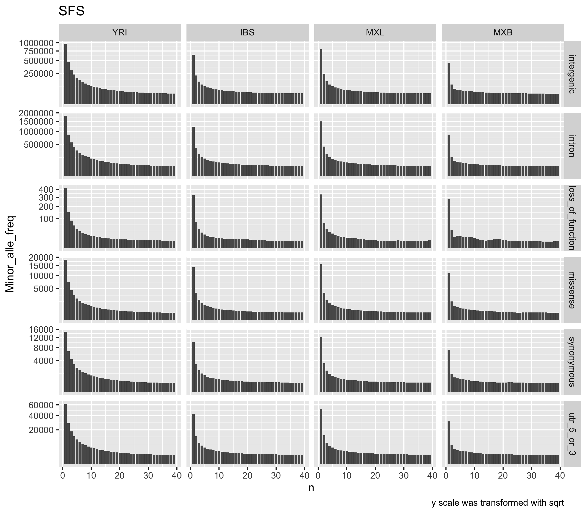
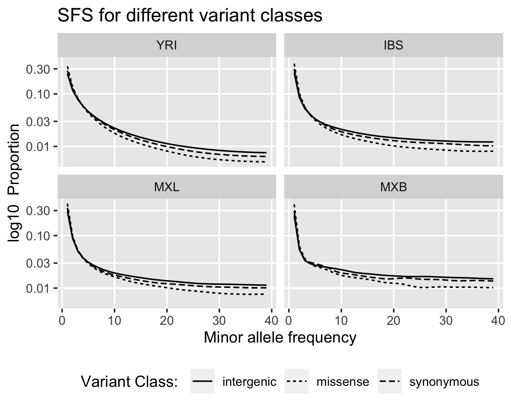
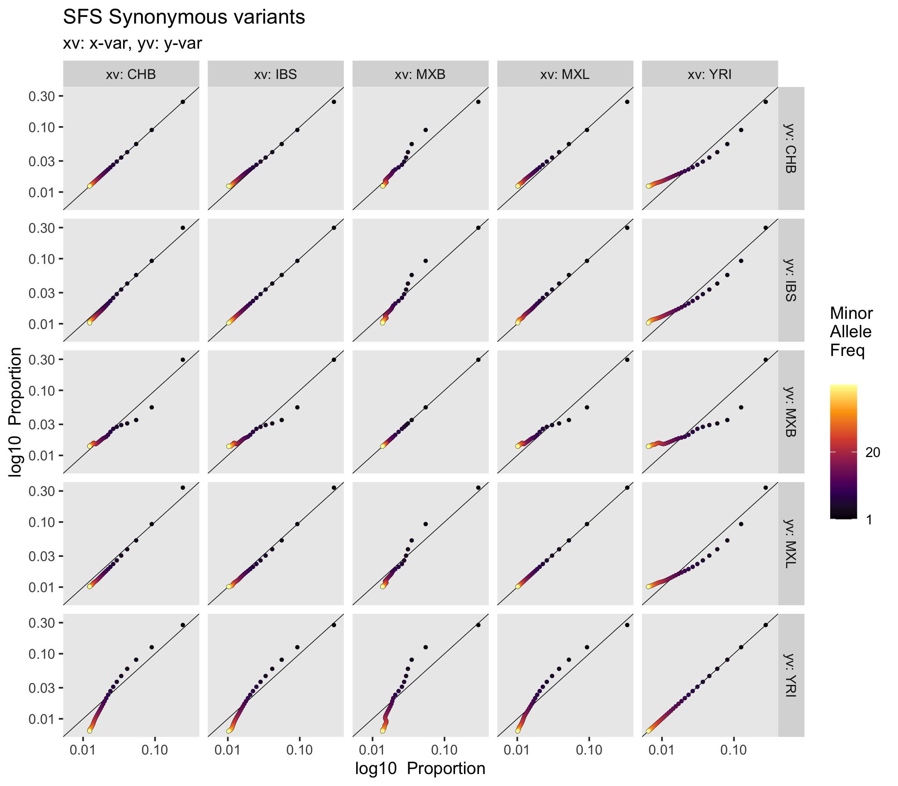
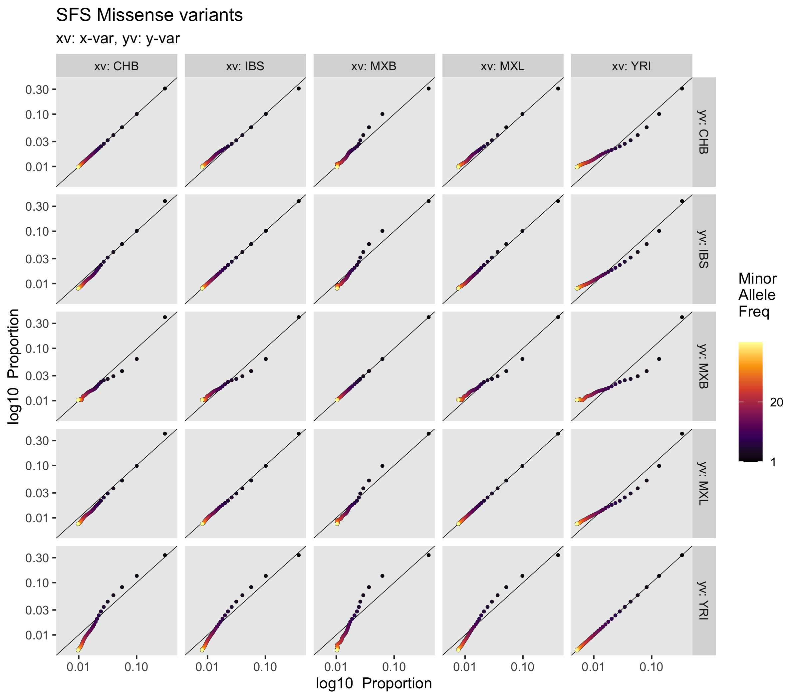
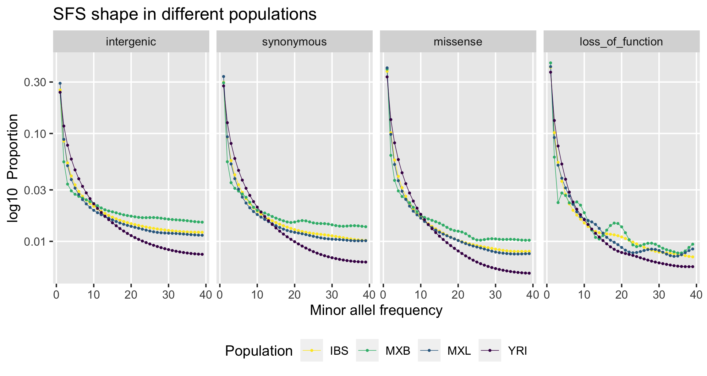

#  SFS by Variant Category, exploratory analysis

## Overview

I will look at the SFS distribution for different variant categories (See the [Snakefile](./Snakefile) for the categories).

For each of these variant categories, we will compute the SFS in each populations. This is similar to the
[previous sfs analysis](../210404-AncestralAlleleSFS).

# Results

**SFS stats**

This table is for synonymous variants.

| case              |      n |         p |
|:------------------|-------:|----------:|
| aa_is_ref         | 127007 | 90.6927   |
| aa_is_alt         |   9228 |  6.5895   |
| aa_is_dot         |   2499 |  1.78448  |
| aa_is_N           |    141 |  0.100685 |
| aa_missing        |    619 |  0.442013 |
| aa_not_ref_or_alt |    547 |  0.3906   |

I projected the SFS to a diploid sample size of 80.

Here, is the SFS for Populations and some variant categories.


To replicate the analysis:

```bash
conda activate popgene  # In kexol
snakemake -j5 all  # to compute the spectrum
python fold-spectrum.py  # fold
# make the plots
Rscript ComparePopulations.R
Rscript variant-classes-analysis.R
```

## Comparing the SFS shape for different variant categories

To compare the shape of the SFS between different variant categories (i.e. synonymous) we scaled the SFS to proportions, so we can compare between variant classes with different number of SNPs.

The following plot shows the pairwise comparison between different variant categories.
Each dot represents a particular site frequency value (color coded). The x-axis gives the proportion for one variant class and the y-axis for the other. I added the identity line (in black color) for visual comparison, allele frequencies that fall on the black line are in equal proportions between the variant classes.
The plot is symmetric with respect to the diagonal.



We were particular interested in comparing *intergenic* variants with *synonymous* variants (row 5 column 1 in the matrix above). The next plot shows the SFS for synonymous, intergenic, and missense variants. We can see that the distribution of synonymous variants in sandwiched between intergenic and missense. This may suggest that synonymous variant are more neutral than missense but not as neutral as intergenic.




***


## Comparing SFS shape for Populations

Now, I focus to compare the SFS shape for different populations. Again the SFS is scaled to proportions.

The following plots follow the same logic as the scatter matrix above, nut now the comparison is between populations (x- and y-axis).





Now, let's look at the actual SFS shape.




# Folded Spectrum

Now, I will repeat the same plots as above but with the folded spectrum.


Here, is the SFS for Populations and some variant categories.



## Comparing the SFS shape for different variant categories

To compare the shape of the SFS between different variant categories (i.e. synonymous) we scaled the SFS to proportions, so we can compare between variant classes with different number of SNPs.

The following plot shows the pairwise comparison between different variant categories.
Each dot represents a particular site frequency value (color coded). The x-axis gives the proportion for one variant class and the y-axis for the other. I added the identity line (in black color) for visual comparison, allele frequencies that fall on the black line are in equal proportions between the variant classes.
The plot is symmetric with respect to the diagonal.


We were particular interested in comparing *intergenic* variants with *synonymous* variants (row 5 column 1 in the matrix above). The next plot shows the SFS for synonymous, intergenic, and missense variants. We can see that the distribution of synonymous variants in sandwiched between intergenic and missense. This may suggest that synonymous variant are more neutral than missense but not as neutral as intergenic.




## Comparing SFS shape for Populations

Now, I focus to compare the SFS shape for different populations. Again the SFS is scaled to proportions.

The following plots follow the same logic as the scatter matrix above, nut now the comparison is between populations (x- and y-axis).






Now, let's look at the actual SFS shape.


